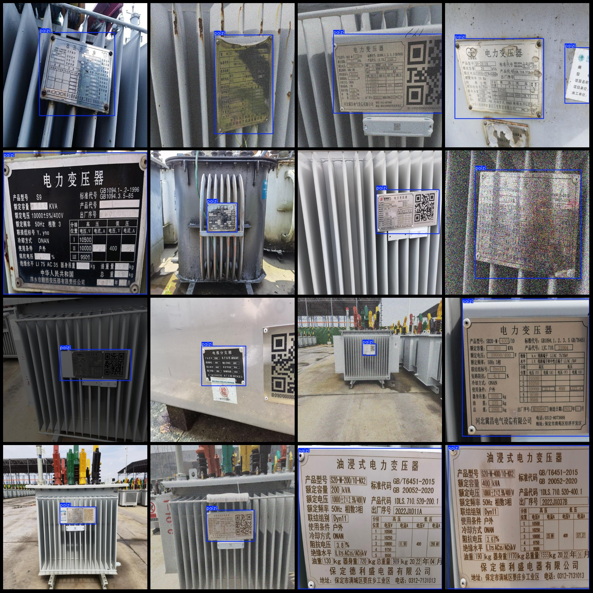
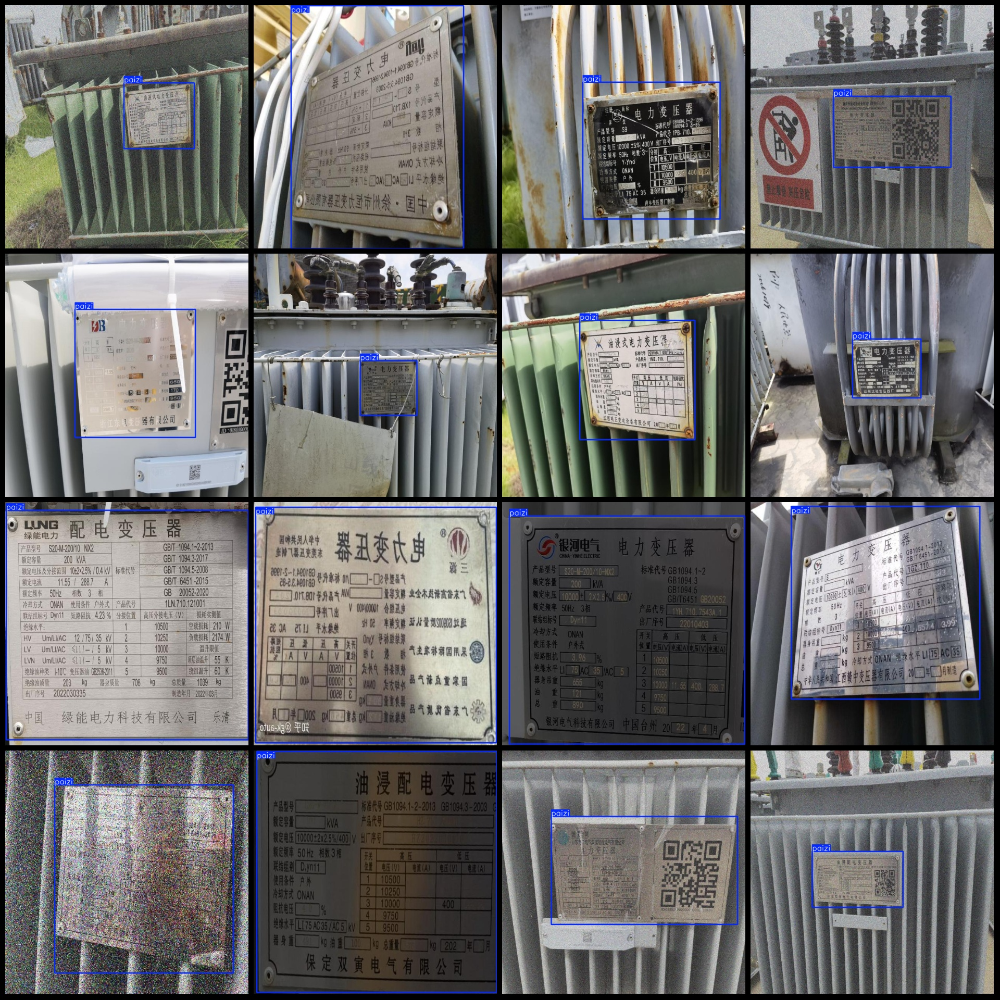

# Electric Power Scenario Transformer Indicator Signage Description Boards and Markers Detection Dataset VOC+YOLO Format: 1424 Images, 1 Classification

Dataset Format: Pascal VOC format + YOLO format (txt file without split paths, only containing jpg images along with corresponding VOC format xml files and yolo format txt files)
Number of Images (jpg file count): 1424
Number of Annotations (xml file count): 1424
Number of Annotations (txt file count): 1424
Number of Annotation Categories: 1
Annotation Category Name: ["paizi"] (Note that the order of categories in the yolo format does not correspond to this, but is based on the labels folder's classes.txt)
Number of Boxes per Category:
- paizi (signage) box count = 1430
Total Boxes: 1430
Image Resolution: 640x640
Annotation Tool Used: labelImg
Annotation Rule: Draw boxes around categories
Important Notice: The dataset does not contain partitioned training/validation/test sets; you need to divide it yourself.
Special Remark: This dataset does not guarantee any accuracy for the trained models or weight files.
Image Preview:
Annotation Example:

## Image

Here is a pay link on Stripe ( https://buy.stripe.com/3cs8yP7sY87d0vu9AB ). Please contact me lonlonago@foxmail.com after funding $89, and I will send you a complete data files , thank you!

